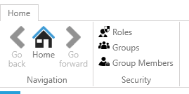
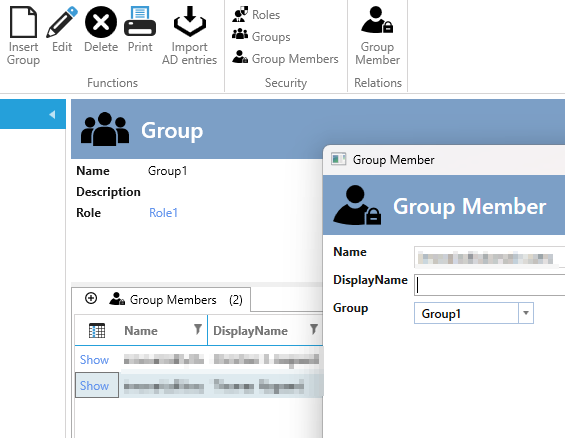
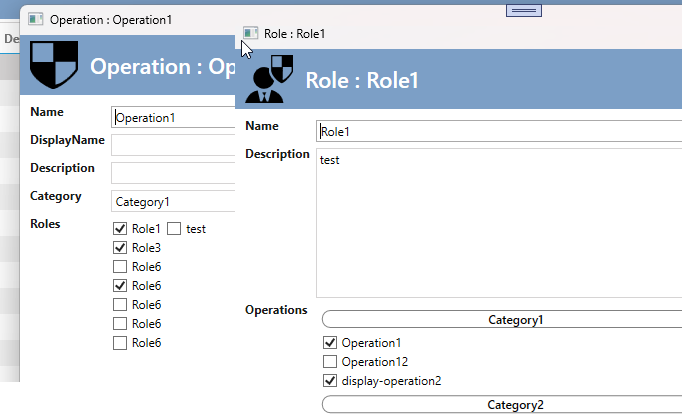
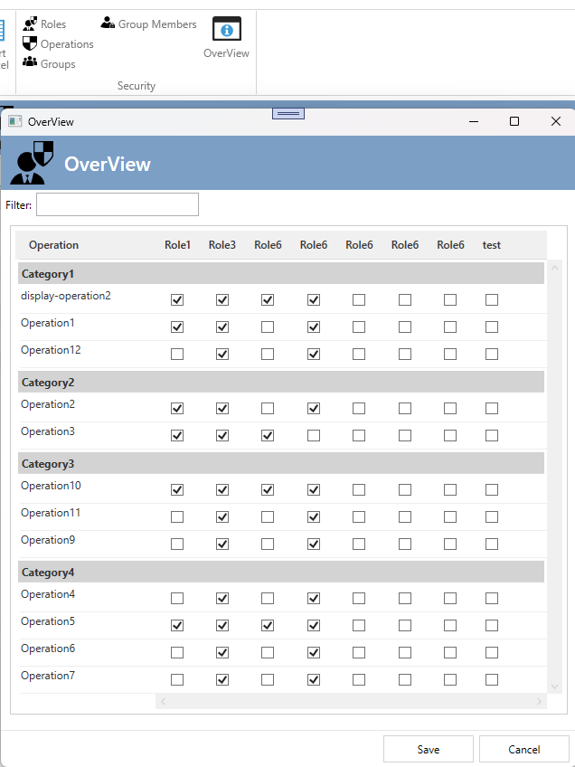

# Security Concept

In the "Security" architecture item, you can define roles and operations, as well as assign roles to specific operations. 
[See more details here](../../guide/elements/security.md).

Up to now, it was the developer's task to define, in code, which roles the user belonged to.

This was done in different ways:

- Creating a SQL table with users and then assigning roles.
- Creating two SQL tables: Groups and a related GroupMember table with users. Then assigning the Group to one or more roles.
- In some cases, the operations were also implemented in a SQL table, allowing all security definitions in the SQL database.

With the Security AppExtension, you can automate all of the above and configure it to fit your specific scenario.

You can choose between two Security AppExtensions:

1. Security - only Roles and Groups 
2. Security - Roles, Groups, and Operations

## Security - only Roles and Groups 

The first implementation includes the basics:

- You can define a Group and its members (supports both AD-logins and AD-groups as members).
- You can define a role and which Group has this role in the application.
- You define the role and operation relationship in the "Security" ArchitectureItem.
- You can only change/add/delete roles, operations, and their relationships at design-time in Visual Studio.

You will get the UI for maintaining this.

Adding roles:

You can then add groups and their members:

## Security - Roles, SecurityGroups, and Operations

This implementation moves all the administration of Groups, Members, Roles, and Operations to SQL Server.
In this implementation, the relationship between Roles and Operations is fetched from the SQL Server, not the code.

You cannot create new operations without first defining them in the Security ArchitectureItem since the operations are used in the code. However, you do not need to define the roles or their operation relationships in the designer, though you can if you prefer. When you "Create code," a SQL statement will be generated to update the SQL database with your new operations, roles, and their relationships.

Now, when creating or editing a role or operation, you can define the relationship here.

You can also maintain the relationships in the "Overview": 

