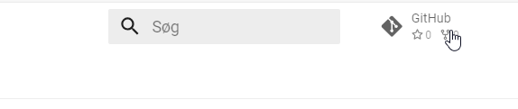

---
hide:
  - navigation
  - toc
---
Det er muligt at lave pull-request til dokumentationen, da den er 100% opensource på Github.

Github repository'et kan nåes ved at klikke øverst i højre hjørne:

## Ændring til den enkelte side.

På den enkelte side i dokumentationen er der et edit-ikon.

Når der klikkes på ikonet åbnes siden direkte i Github og herfra kan der laves et pull-request til repository'et.

Pull-request'et reviews af Innova IT og merges ind hvis det accepteres.

## Forslag til indhold som ikke findes

Det kan være at der er forslag til indhold i dokumentationen, som ikke findes endnu.

I de tilfælde åbnes et issue i det lukkede Azure Devops på samme måde, som hvis man finder fejl i frameworket.
