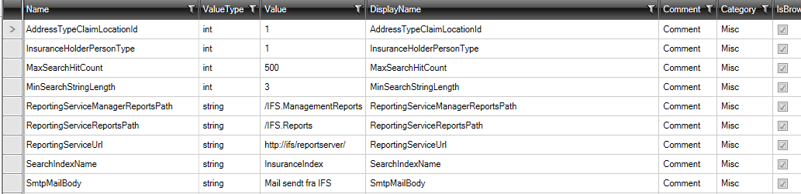
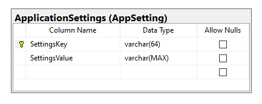

# Appsettings 

Formålet med elementerne "Appsettings"  er at implementere applikationsvariabler lagreret i SQL databasen i stedet for i f.eks. en konfigurationsfil.
Dermed kan applikationsvariabler ændres løbende f.eks. inde i applikation af en administrator. 

For at tilføje ”Appsettings" vælges fanebladet ”Designer” og klik på knappen ”Add ArchitectureItem…” og vælg ”Appsettings".

Designeren for ”Appsettings ser således ud:

Her kan man indtaste parameter-navne i liste under "Name" og hvilken .net type i "ValueType".

Resten af felter bruges kun hvis man vil vise alle appsettings i en propertygrid (se senere).

Når man kodegenerer laves to filer:

- AppSettings.tt.cs 
- AppSettings.tt.sql

Sql-filen indeholder sql-script til oprette tabellen og indsættelse af data i tabellen.

cs-filen indeholde koden, som gør at man nu kan bruge appsettings i applikationen.

