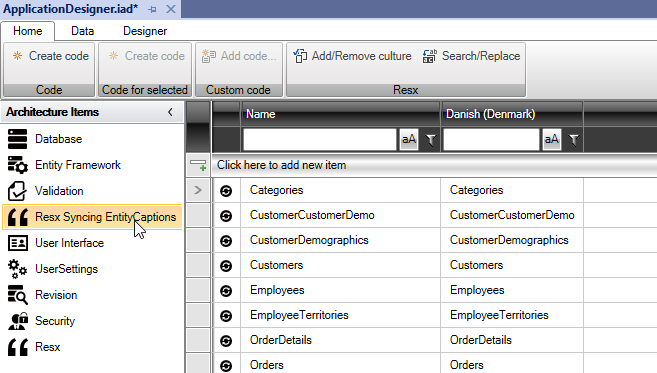
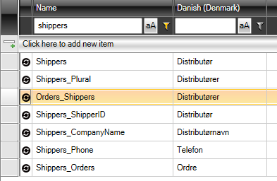
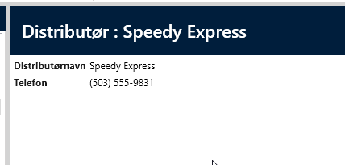
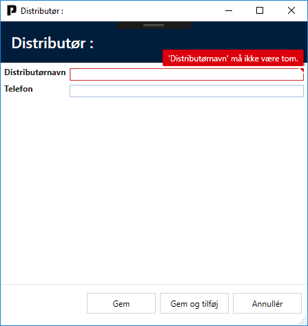

# Resx Syncing EntityCaptions

"Resx Syncing EntityCaptions" bygger oven på "Resx".

Formålet med "Resx Syncing EntityCaptions" er at oversætte navnene på datamodellen og dermed gøre applikationen flersproget.
Den læser meta-data fra "Entity Framework" (klassenavne og properties) og oprette selv posterne i listen.

For at tilføje "Resx Syncing EntityCaptions" skal du vælge fanen "Designer" og klikke på knappen "Add ArchitectureItem...". Vælg "Resx Syncing EntityCaptions".

Derefter får du følgende designer:

Den første kolonne indeholder de termer, som koden bruger, og den næste kolonne (under "Dansk (Danmark)") er en liste over de termer / overskrifter, der vises i applikationen.

Der kan tilføjes nye sprog ved at klik på "Add/Remove culture".

Du kan søge i listen under "Navn" eller "Dansk (Danmark)".

Eksempel:

Søg efter "shippers" under "Navn", og designeren vil se sådan ud:

I kolonnen "Dansk (Danmark)" kan du nu justere de termer / overskrifter, du ønsker at have i applikationen.

Klik på "Create Code" og kør applikationen. Skærmbillederne vil nu have de nye termer / overskrifter:

Det er også muligt at ændre Captions for entiteter i arkitekturelementet "User Interface".