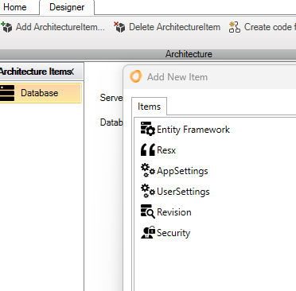

Innova Developer Platform fungerer gennem en simpel, men effektiv trefaset proces:

1. **Valg af arkitektur-element:** I designeren vælges de nødvendige arkitekturelementer til applikationen.
   
   

2. **konfiguration af arkitekturelement:** Hvert arkitekturelement konfigureres og tilpasses efter behov.

3. **Kodegenerering:** Efter konfiguration trykkes på "Create code", og den tilpassede kode produceres automatisk.

   

Den genererede kode præsenteres direkte i Visual Studio's solution explorer. Kodefiler med extension "*.tt.cs" bør ikke ændres, da de vil blive overskrevet ved næste kodegenerering. Takket være partial-klasser, er der mulighed for at bygge videre på den genererede kode ved at tilføje egne metoder.

