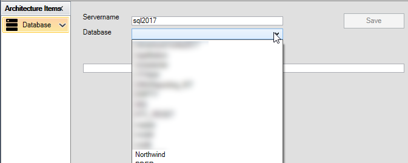

# Database

Formålet med "Database" er at konfigurere, hvilken database du vil bruge i
applikationen.

Der er 2 konfigurationsmuligheder:

- Servernavn: navnet på SQL Serveren
- Database: navnet på databasen

Ved at indtaste navnet på SQL Serveren præsenteres databasenavne i
rullelisten under "Database". Vælg her Northwind og klik på "Gem".

