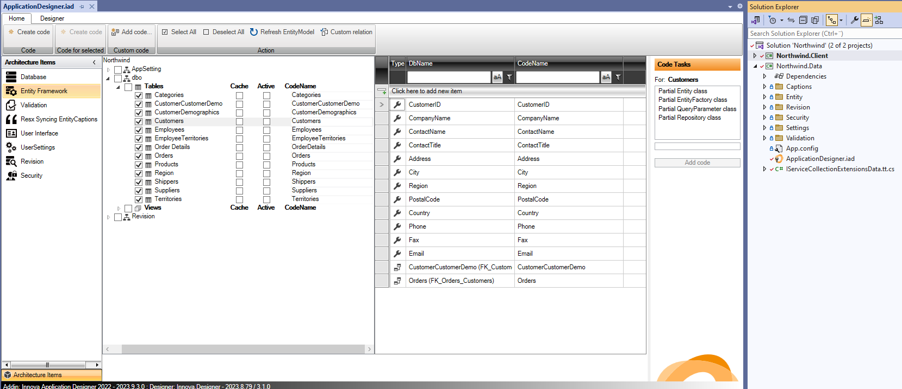
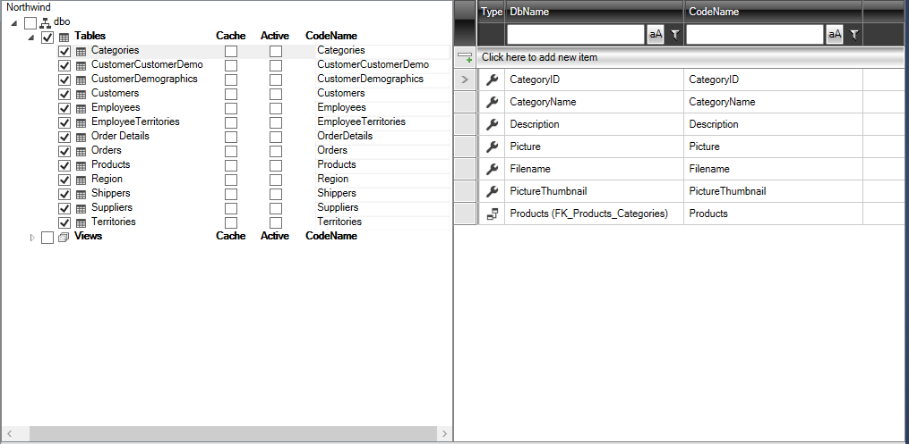
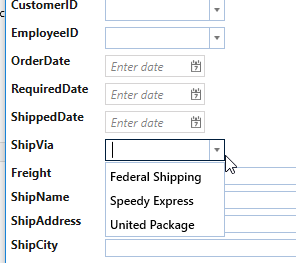
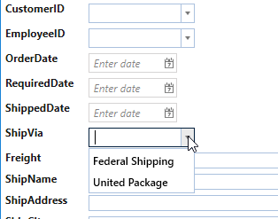

# Entity Framework

"Entity Framework"-elementet bruges primært til at udvælge, hvilke tabeller og views fra SQL databasen du ønsker at inkorporere i din applikation.

Efter tilføjelsen af dette arkitekturelement præsenteres du for nedenstående konfigurationsskærm:

Skærmbilledet viser en liste over alle tabeller og views i databasen. Markér de ønskede tabeller/views ved at klikke på afkrydsningsboksene ved siden af dem. For at vælge alle tabeller under "Tables", markér blot denne.

Som det fremgår herunder, er alle tabeller valgt:

Efter konfigurationen skal koden genereres. Klik på "Create Code" knappen placeret yderst til venstre:

Efter dette trin indeholder Visual Studio nu et nyt bibliotek kaldet "Entity", som inkluderer følgende filer:

Blandt disse filer finder du kode for:

- Entity Framework (code first): Context.tt.cs og Entities.tt.cs
- Unit Of Work: UnitOfWork.tt.cs

På dette tidspunkt har din applikation et fuldt operationelt datalag, og du kan eksempelvis starte med at opdatere data i databasen. Resten af konfigurationsindstillingerne vil blive dækket senere, men du kan allerede nu tilføje yderligere arkitekturelementer til din applikation.

Hvis datamodellen ændres i SQL databasen, så vil ændringen afspejles automatisk i designeren næste gang den åbnes. Derefter er det bare at klik "Create Code" og så er den nye datamodel kodegenereret.

## Konfiguration

I "Entity Framework" konfigurationen vil følgende indstillinger blive automatisk fastsat:

- Entitetsnavn (standard er tabelnavnet)
- Entitetsattributnavne (standardnavnene på tabelens felter)
- Standard ToString metode for entiteten
- Standard sortering for lister
- Implementering af caching
- Implementering af "Aktiv" status

### Tilpasning af entitetsnavne

I designvinduet kan du ændre navnet på en entitet i den højre kolonne, hvis du for eksempel ikke ønsker, at visse attributter skal bære databasens felt navn. Dette kan gøres i "CodeName" kolonnen:

### Tilpasning af standard ToString

Som en generel regel bliver det første tekstfelt i entiteten benyttet som ToString for denne entitet.

For at ændre dette, vælg "Entity Framework" og klik derefter på entiteten "Categories". Nu burde konfigurationsindstillingerne for "Categories" blive vist i egenskabsvinduet i Visual Studio.

"DefaultTostringFieldname" er som standard sat til CategoryName. 

Dette kan ændres ved at vælge et andet felt fra dropdown-menuen. 

### Tilpasning af sortering

Der er allerede sat en standard for, hvilket felt der skal sorteres efter (det første tekstfelt) samt sorteringens retning (ascendende eller descendende). Dette kan ændres ved at vælge et andet felt fra dropdown-listen.

### Implementering af cache

Caching anvendes typisk på i tabeller, hvor data sjældent ændres. Dette er typisk relevant for opslags-/værdi-/lookup-tabeller. Ved at aktivere caching for en entitet vil data blive hentet fra SQL databasen den første gang, mens alle efterfølgende forespørgsler vil trække data fra applikationens lokale cache. Cacheindholdet vil blive slettet ved applikationsafslutning, så ved næste opstart hentes data først fra databasen og derefter fra cachen.

Du kan konfigurere caching enten fra egenskabsvinduet for den specifikke entitet eller direkte i designervinduet. Herunder er caching aktiveret for Region, Suppliers og Territories:

### Implementering af "Aktiv"

"Aktiv"-funktionen anvendes ofte for opslags- eller lookuptabeller for at styre, hvornår en bestemt række i tabellen er aktiv og derfor bør vises i applikationen. For at illustrere dette, lad os tage et eksempel:

Antag, at entiteten/tabellen "Shippers" indeholder leverandører, der kan håndtere individuelle ordrer. Med tiden kan det blive nødvendigt at udskifte leverandører. Men det er vigtigt stadig at kunne identificere, hvilken leverandør der håndterede en tidligere ordre. Derfor, når en ny ordre oprettes, bør dropdown-menuen for leverandører kun vise de "aktive" leverandører. Men for ældre ordrer bør "inaktive" leverandører stadig være synlige.

For at implementere "Aktiv"-funktionaliteten på Shippers, markér "Aktiv" for Shippers og klik derefter på "Create Code". Dette vil generere en SQL-fil, der tilføjer to nye felter til Shippers-tabellen:

- ActiveFromDate: angiver fra hvilken dato rækken er aktiv
- ActiveToDate: angiver til hvilken dato rækken er aktiv

Efter at have kørt SQL-filen på databasen, vil du bemærke, at ActiveFromDate som standard er sat til dagens dato.

For at opdatere entitetsmodellen, klik på "Refresh EntityModel" i designervinduet og tryk derefter på "Create code". Kør derefter din applikation, vælg ordrelisten og klik på "Tilføj". "ShipVia"-feltet vil indeholde en dropdown-liste med alle tre leverandører:

Men hvis der er angivet en værdi i ActiveToDate:

Vil dropdown-listen ikke vise "ShipVia" for denne leverandør:

Dette giver en let måde at administrere opslagstabeller på ved hjælp af "Entity Framework" konfigurationen.
