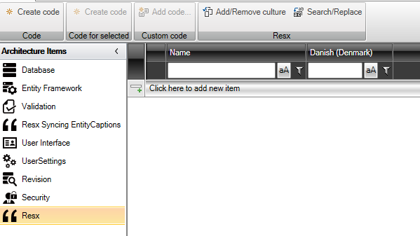
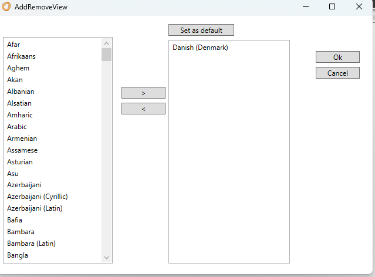
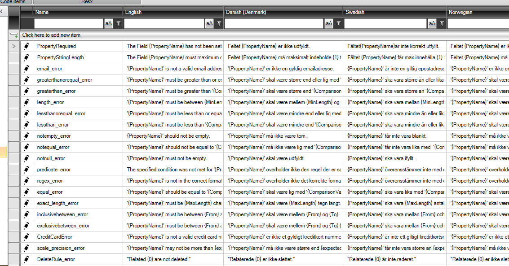

# RESX

"Resx" tilbyder en centraliseret tilgang til at håndtere al tekst, der anvendes i en applikation. Dette gør det enkelt at implementere flersproget support og sikre, at applikationen kan nå ud til et bredere publikum med forskellige sprogpræferencer.

De genererede koder fra dette værktøj er resx-filer. Disse filer er kendte og almindeligt anvendte inden for [Localization in .NET](https://learn.microsoft.com/en-us/dotnet/core/extensions/localization). Resx-filer er XML-baserede og indeholder nøgle-værdi-par, hvor nøglen repræsenterer en unik identifikator for en given tekststreng, mens værdien repræsenterer selve teksten.

Med "Resx" kan udviklere nemt:

1. **Centralisere tekst**: Alle tekstbeskeder, labels og UI-elementtekster kan centralt styres fra resx-filerne.
  
2. **Skifte sprog dynamisk**: Ved at skifte den aktive resx-fil kan applikationen dynamisk ændre sprog, hvilket gør det nemt at skifte mellem forskellige sprogversioner.

3. **Understøtte flere sprog**: Ved at tilføje flere sprog, kan udviklere nemt udvide deres applikations sprogunderstøttelse.

4. **Vedligeholde tekst**: Ændringer i tekst eller tilføjelse af nye tekster kan nemt implementeres ved at opdatere "Resx" uden nødvendigvis at skulle ændre selve koden i applikationen.

5. **Integrere med .NET**: Da resx-formatet er dybt integreret med .NET-platformen, kan udviklere drage fordel af værktøjer og biblioteker, der specifikt er designet til at arbejde med resx-filer.

For at maksimere fordelene ved "Resx" bør udviklere sørge for konsekvent at referere til tekster via deres resx-nøgler i stedet for at hardkode tekststrengene direkte i koden. Dette vil sikre, at teksten kan ændres eller oversættes uden at skulle dykke dybt ned i applikationskoden.

## Konfiguraitionen

Efter tilføjelsen af "Resx"-arkitekturelement bruges nedenstående til at konfigurerer tekster:

Som standard er der to kolonner "Name" og "Danish (Denmark)". I "Name" indtastes nøglen der bruges i koden og i "Danish (Denmark)" indtastes den tekst der skal præsenteres i den danske udgave af applikationen.

Det er selvfølgelig muligt at tilføje yderligere sprog. Klik på "Add/Remove culture" for at gøre dette.

Her er vist et eksempel på en applikation, der understøtter engelsk, dansk, svensk og norsk.

Når al tekst er indtastet, klik på "Create Code" og der genereres en resx-fil pr sprog.

