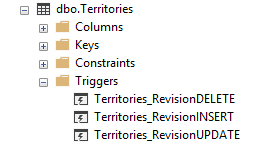
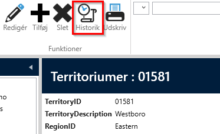
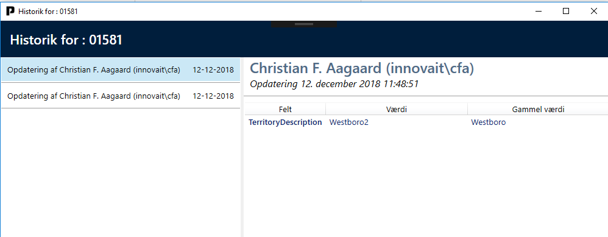

# Revision

Formålet med "Revision" elementet er at implementere datahistorik for den
enkelte entitet/tabel.

For at tilføje "Revision" skal du vælge fanen "Designer" og klikke på knappen "Add ArchitectureItem…" og vælg "Revision".

Designer for "Revision" ser sådan ud:

Det er muligt at afkrydse de entiteter/tabels, der skal have revision.

Hvis der sættes kryds ved Territorier og klik på "Create Code" vil følgende kode vil blive
genereret.

Kør "AlterScript.sql" i Northwind-databasen. Scriptet vil oprette en
"Territories"-tabel i "Revision"-skemaet med følgende felter.

Og SQL-Triggers oprettes på "Territories"-tabellen.

Nu er databasen klar til at håndtere revision. Enhver ændring i tabellen
"Dbo.Territories" vil blive afspejlet i "Revision.Territories".

Kør applikationen. Vælg listen over "Territories" og vælg en "Territory".
Bemærk, at der er dukket en ny knap op i værktøjslinjen.

Klik på "Rediger" og ændr "Beskrivelse" og klik på "Gem". Klik derefter på knappen
"Historik". Et vindue vil åbne sig:

På højre side opregnes, hvem og hvornår noget er ændret på den pågældende person
entitet. På venstre side vises ændringen i spørgsmål; hvilket felt og gammel
og ny værdi.