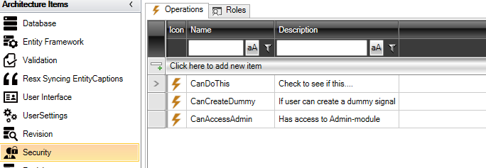
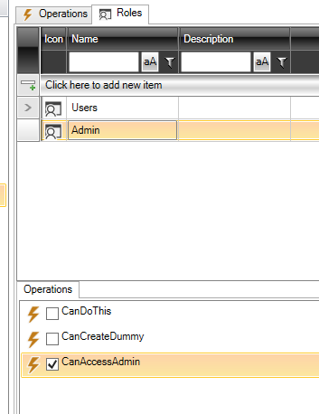

# Security

Formålet med ”Security” er at styre hvad den enkelte bruger har adgang til i applikationen.

I elementet "Security" konfigureres 2 ting:

- Operations
- Roles

## Operations

Operations er det man vil spørge på om brugeren har adgang til. F.eks. ved en knap.

Her er bl.a. defineret "CanAccessAdmin" og den bruges til at spørge på om man skal have adgang til "Administration" i applikationen.

## Roles

Under roles defineres de roller, som er i applikationen. I dette tilfælde er der defineret "Users" og "Admin" (Administratorer).

Nedenunder vælges hvilke operations den enkelte rolle har adgang til.  I dette tilfælde så har administrator-rollen adgang til "CanAccessAdmin".
