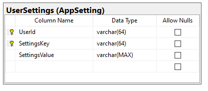

# UserSettings

Formålet med usersettings er at gemme settings på samme måde, som appsettings. 

Dog er usersettings bruger-specifikke. Det betyder at man kan bruge usersettings til at f.eks. at gemme parameter som er unikke for den enkelte bruger.

Selve tabellen ser således. 

Ellers er brugen og det kodegeneret det samme som appsettings.

