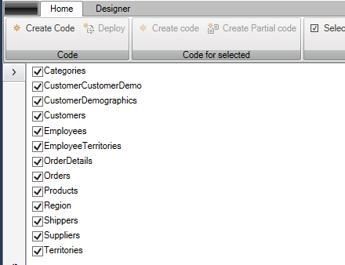

# Validation

Formålet med "Validation" er at generere kode for valideringsreglerne for hver enkelt tabel/entitet. Eksempelvis, hvis en SQL-tabel indeholder et felt, der ikke må være "null", vil der blive genereret en valideringsregel, der sikrer, at denne regel overholdes. Dette vil også informere brugeren om, at feltet skal udfyldes.

For at indføre "Validation", skal du først navigere til "Designer"-fanen og derefter klikke på "Add ArchitectureItem...". Herfra vælger du "Validation".

Dernæst har du mulighed for at vælge, hvilke entiteter der skal genereres valideringer for. På værktøjslinjen finder du en "Select all"-knap; ved at klikke på denne vil alle entiteter automatisk blive markeret.

Efter at have gennemført konfigurationen, klikker du på "Create code"-knappen. Dette vil resultere i tilføjelsen af en ny fil ved navn "Validators.tt.cs" i entitetsmappen.

Når du nu starter applikationen og vælger "Shippers", efterfulgt af et klik på "Tilføj", vil du se følgende skærmbillede:

Hvis du forsøger at klikke på "Gem" uden at have udfyldt nødvendige felter, vil følgende fejlmeddelelse blive præsenteret:

