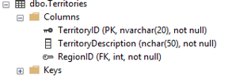
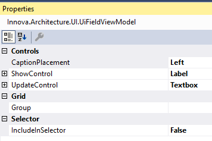
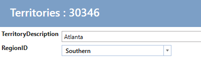
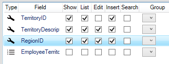

# User Inteface

Formålet med elementet "User Inteface" er kun at konfigurere og generere kode til
applikationens brugergrænseflade.

!!! note "User Inteface"
    I nedenstående eksempel anvendes komponenter fra Telerik i applikationen.

    Innova IT har kodegenerering for [Telerik](https://www.telerik.com/) og [Infragistics](https://www.infragistics.com/).
    

Vælg fanen "Designer" og klik på knappen "Tilføj arkitekturelement",
vælg "User Inteface".

## Konfiguration

Når elementet "User Inteface" er valgt, vises følgende designer:

Venstre side lister alle de entiteterne, der er valgt at der skal genereres skærmbilleder for. 
For at se alle entiteter i applikationen, klik på "Show All entities". Her vælges entiteterne ved at sætte hak.

Højre side lister den valgte entitets felter. For hver entitet bliver der lavet 5 skærmbilleder: 

- Show - skærmbillede til at vise den enkelte entitet.
- List - skærmbillede med liste af entiteter.
- Edit - skærmbillede til redigering af den enkelte entitet.
- Insert - skærmbillede til at indsæt ny entitet.
- Search - skærmbillede til at søgning.

Ved at sætte et hak ud for et felt, under et "skærmbillede" betyder at det felt kommer med i skærmbilledet.

Så i eksemplet ovenfor vil felterne: CompanyName, ContactName,
ContactTitle, Address og City blive vist i listen for Suppliers. 

### Kontroller

Det er auto-konfigureret, hvilke kontroller (tekstfelt, etiket, rullemenu osv.) der
skal bruges i individuelle felter i visning, redigering, indsættelse og søgning. Det sker baseret på regler
om datatypen og eventuelle relationer.

For eksempel, for entiteten "Territories"

| Datatyper |  |
| Data |  |

Den auto-konfigurerede kontrol for feltet "TerritoryDescription" er indstillet til
"Label" på Vis og Tekstboks som UpdateControl (indsæt, rediger og søg). Det kan
ses ved at vælge feltet "TerritoryDescription" i designeren, så vises de
konfigurerede værdier i Properties-vinduet i Visual Studio.

| Visning | Redigering | Indsæt |
| -------------------------------------------- | ---------------------------------------- | ----------------------------------- |
|  |  |  |

Disse kan konfigureres til andre kontroller ved at ændre f.eks. UpdateControl
"Textbox" til "BigTextBox" (en stor tekstboks med linjeskift). Klik på "Create Code"
og kør applikationen. Så vil indsæt/redigeringsskærmbilledet / visningen se sådan ud:

For feltet / ejendommen "RegionID" er der en relation til "Region" og kontrollen
indstilles automatisk til Label for Visning og "ComboBox - Telerik" til UpdateControl:

Og redigering / indsættelse ser sådan ud:

Følgende kontroller er tilgængelige:

| Kontrolnavn | Beskrivelse |
| --------------------------------------- | --------- -------------------------------------------------- ------------------------------------- |
| Calendar - Telerik | Telerik - RadDateTimePicker |
| Checkbox | Afkrydsningsfelt |
| Checkbox - Readonly | Afkrydsningsfelt, bruges primært til visningsskabelon |
| Checkbox list | Afkrydsningsliste, bruges til mange-til-mange-forhold |
| Combobox - Telerik | Telerik radcombobox, der filtrerer værdier i henhold til det, der er skrevet i den. |
| ComboboxWithContains - Telerik | Telerik radcombobox, der filtrerer værdier i henhold til det, der er skrevet i den og viser listen. |
| Combobox with add button - Telerik| Combobox, hvor man kan tilføje entiteter til combobox'en  |
| Custom kontrol | Brugerdefineret kontrol, valgt hvis du vil kode din egen kontrol til det specifikke felt. |
| Currency - Telerik| RadMaskedCurrencyInput |
| Image - Editor | Rediger et varbinary-felt i databasen. Upload filer. |
| Image - Show | Viser et varbinary-felt fra databasen som et billede. |
| Label | En tekstblok med mulighed for at indstille formatstreng. |
| LabelList | En liste der viser relateret entiteter som en liste. |
| LinkButton | En knap, der vises som et hyperlink. Bruges til at vise data på et klikbart label. |
| Numeric - Telerik| RadMaskedNumericInput |
| RadioButtonList | viser en Radiobutton-liste med relateret entiteter |
| Relation Label - List comma separated | Som ovenfor, men vist som kommaet indstillet på en linje. |
| Textbox - Telerik| RadWatermarkTextBox  |

### Relationer

Under listen med felter er listet entitetens relationer. Hvis der sættes hak i relationen bliver relationen vist som faneblad i på show-siden.

Her er resultatet af ovenstående konfiguration.

## Captions

Ved at vælge fanebladet "Captions" kan alle captions, tooltips og Watermarks for den enkelte entitet nemt vedligeholdelse.

Nedenfor er vist for Categories.

## UI Designer

Som standard viser alle felter i show/edit/insert i en række. Det kan tilpasses ved at bruge fanebladet "UI Designer".

I "UI Designer" designes en grid med x antal Columns og x antal Rows. En celle kan så indeholde en Group af felter. Nedenfor er vist en konfiguration af en grid til Employees

Denne konfiguration gør at show/edit/insert vil blive vist som nedenfor:

