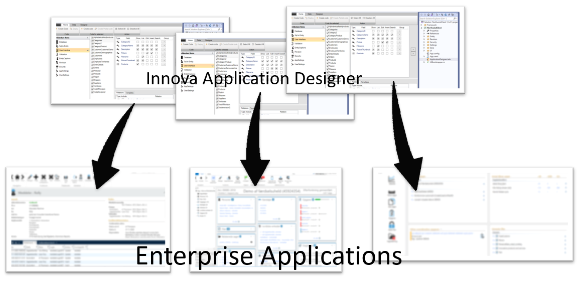

# Processen

Med Innova Developer Platform får du en ensartet udviklingsmetodik for alle forretningsapplikationer, hvilket sikrer konsistens i forhold til teknologi, designmønstre osv.

Dette betyder, at hvis du er ansvarlig for, lad os sige, 10 forretningsapplikationer i din organisation, opnår du en homogenitet i udviklingen, som er udfordrende at opnå gennem andre metoder.

Da de specifikke arkitekturelementer kontinuerligt opdateres med nye versioner, for eksempel fra Microsoft, vil selv ældre applikationer modtage disse opdateringer automatisk, næste gang du genererer kode.