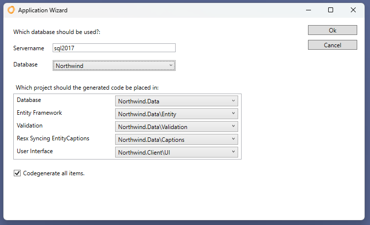
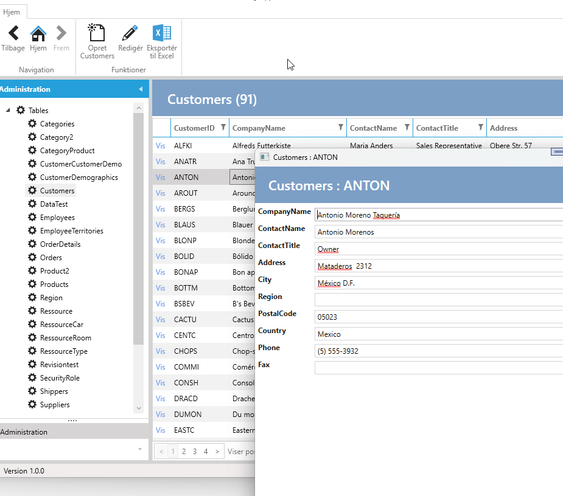

# Første applikation

Det tager ikke lang tid at få den først applikation klar.

<iframe width="560" height="315" src="https://www.youtube.com/embed/yoSoRPW3bNQ?si=-KmyoaimZQiN9PsQ" title="YouTube video player" frameborder="0" allow="accelerometer; autoplay; clipboard-write; encrypted-media; gyroscope; picture-in-picture; web-share" allowfullscreen></iframe>

IDP'en kommer med en projekt-Wizard i Visual Studio. Vælg "IDP Solution" i "Create new project". Det er muligt at filtre i "Project Types" og vælge "IDP".

Klik Next. Udfyld navnet og klik Create.

Wizarden laver en solution med 2 projekter:

- *Applicationname*.Client
- *Applicationname*.Data

I data-projektet er der tilføjet en IAD-fil, som indeholder konfigurationen.
Denne bliver åbnet automatisk og viser 3 mulige applikationstyper:

Vælg "Wpf - Telerik" og klik ok.

Indtast SQL Server navn og vælg database og klik ok.

Kør projektet. Det er nu muligt at navigere mellem tabeller/entitetter, redigere, indsæt og slette data.

Næste skridt er at tilpasse applikationen med f.eks. navigeringsknapper, tilpasning af brugergrænseflade m.m.
