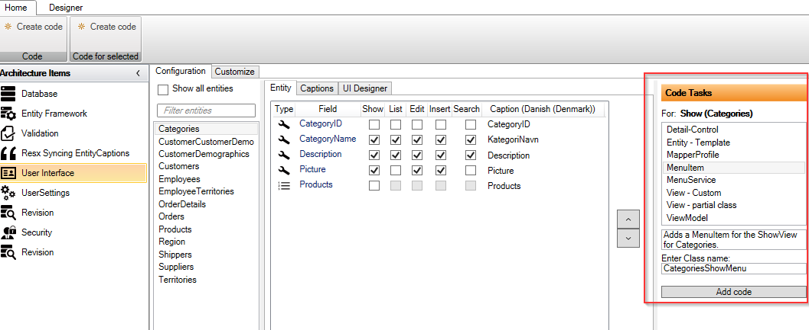
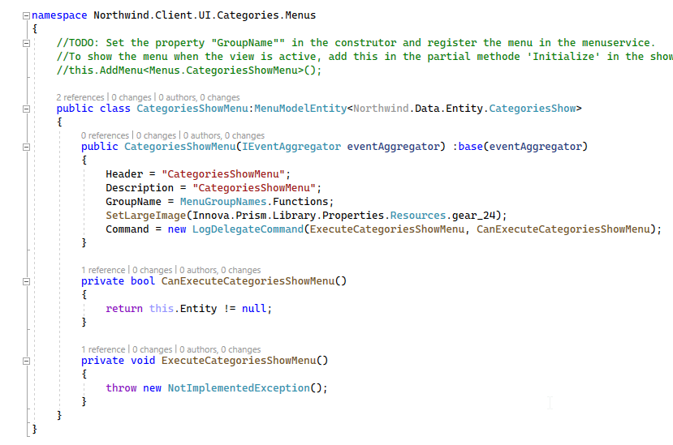
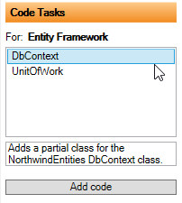
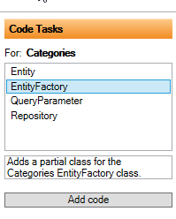

# Code Tasks - Configuration

Det er vist som "Code Tasks" i højre side af designeren.

Ovenfor er vist konfiguration for "User Interface", hvor der er valgt "Categories" og fanebladet "Show" er valgt.
Så viser "Code Tasks" hvilke kode-opgaver den kan hjælpe med. I dette tilfælde er der valgt "Menu item", hvilket betyder at når der klikkes på "Add Code" knappen, så tilføjes et menu-punkt i værktøjslinjen for Show-skærmbilledet, når en "Categories" vises.

Til forskel for den almindelig kode-generering (når man klikker på "Create code"), så er genereringen af kode via "Code Task" en one-off, dvs koden bliver kun genereret en gang og uden "tt.cs", men som almindelige cs-filer. Disse kan derfor frit ændres efterfølgende.

Ved at klikke på "Add code" bliver koden nedenfor genereret og klar til at blive tilpasset af udvikleren.

Bemærk kommentaren ovenfor klassen, som beskriver hvordan man bruger koden.

De forskellige Code Tasks bliver vist alt efter hvilket konfiguration-element, der er aktiv. Så hvis f.eks. "Entity Framework" er valgt, så er det muligt at lave partial classes til DbContext og UnitOfWork, som vist nedenfor.

Hvis der vælges en entitet f.eks. Categories, så kommer der andre Code Tasks frem.

For at gøre det nemmere at få et overblik over Code Task for de enkelte Arkitektur-elementer, er der et faneblad "Customize" som viser alle Code Tasks.