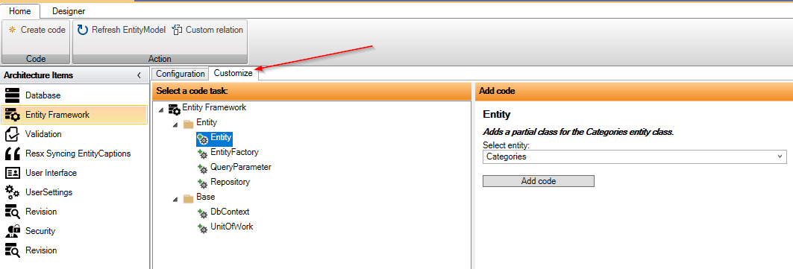
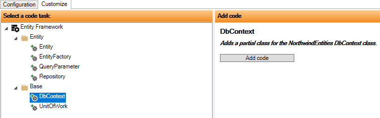
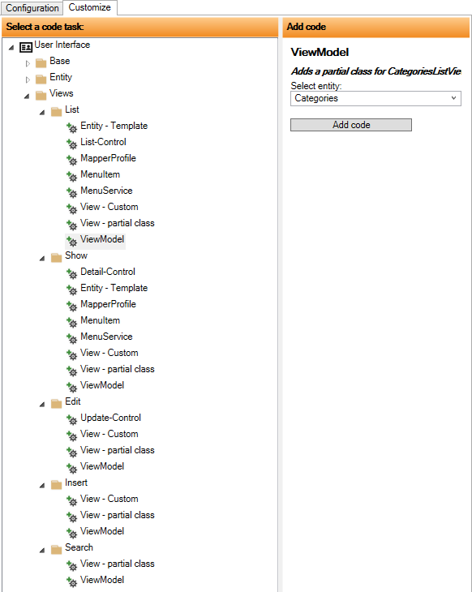

# Code Tasks - Customize

Fanebladet "Customize" giver adgang til alle "Code Tasks", så er man fri for at klikke rundt i konfigurationen for at finde de relevante Code Tasks.

Efter der er valgt en Code Task vises detaljerne for Code Tasken i højre side. Og i ovenstående tilfælde skal der vælges en entitet og derefter klikkes på "Add Code".

Hvis der er valgt f.eks. DbContext, som nedenfor, så vises listen med entiteter ikke.

"Customize" er specielt velegnet, hvor der er mange Code Tasks. Nedenfor vises "Customize" for "User Interface".

