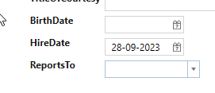

# Entity Factory

**Requirement**: The "HireDate" property on "Employees" should have a default value set to today's date when a new employee is created.

**Task**: Create a partial class for the code-generated EmployeesEntityFactory and implement the partial method "SetDefaults".

**Execution**: 

1. Select "Entity Framework".
2. Select "Employees".
3. Under "Code Tasks", choose "EntityFactory" and click on "Add Code". An EmployeesEntityFactory.cs file will now be generated, which can be customized as desired, as shown below. In this example, the partial method "SetDefaults" is implemented.

```cs
    public partial class EmployeesEntityFactory
    {
        partial void SetDefaults(Employees employees)
        {
            employees.HireDate = DateTime.Now;
        }
    }
```

Now the default value for "HireDate" will be set to today's date when a new "Employees" is created.

