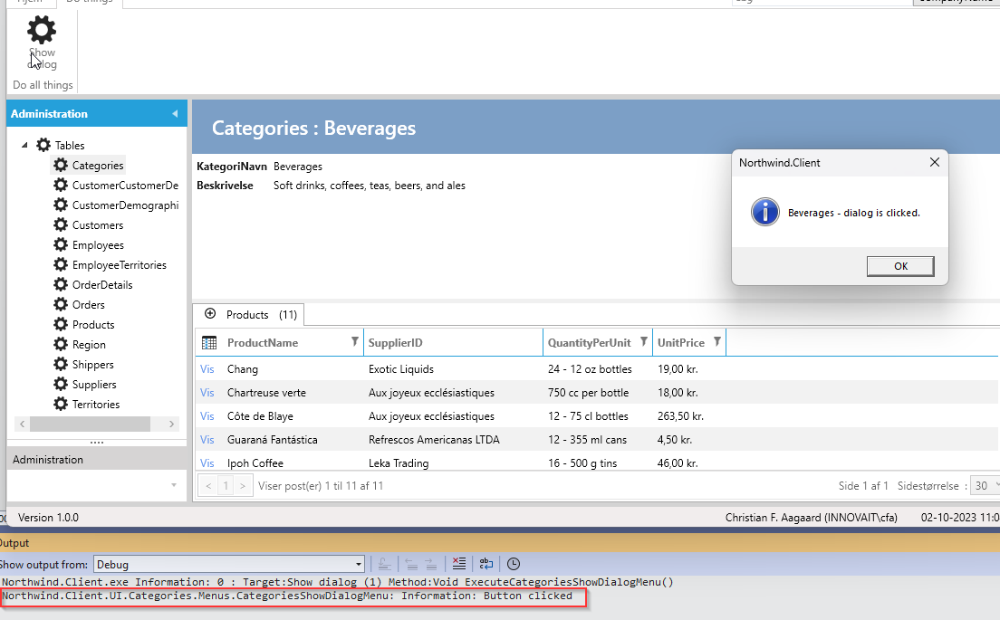

Innova Framework bruger [Microsoft.Extensions.Logging](https://learn.microsoft.com/en-us/dotnet/core/extensions/logging?tabs=command-line) til at håndtere logging.

Dermed kan der bruges diverse 3. parts logging providers til at udføre selve logging (til tekst-filer, database, webservice m.m.). [Se eksempel på providers her.](https://learn.microsoft.com/en-us/dotnet/core/extensions/logging-providers#third-party-logging-providers)

Når der er behov for at logge injects'e ILogger i constructor'en.

**Krav**: Når der klikkes på knappen i CategoriesShowDialogMenu skal det logges. 

**Opgave**: Inject ILogger og kald LogInformation i onExecute.

**Udførelse**: 

```cs
    public class CategoriesShowDialogMenu:MenuModelEntity<Northwind.Data.Entity.CategoriesShow>
    {
        private readonly IWindowDialogService _windowDialogService;
        private readonly ILogger<CategoriesShowDialogMenu> _logger;

        public CategoriesShowDialogMenu(IEventAggregator eventAggregator,
                                        IWindowDialogService windowDialogService,
                                        ILogger<CategoriesShowDialogMenu> logger) :base(eventAggregator)
        {
            _windowDialogService = windowDialogService;
            _logger = logger;

            Header = "Show dialog";
            Description = "Click to show dialog";
            GroupName = MenuGroupNames.Functions; 
            SetImages(Innova.Prism.Library.Styles.WindowsMenuImages.gear);
            Command = new LogDelegateCommand(ExecuteCategoriesShowDialogMenu, CanExecuteCategoriesShowDialogMenu);
            
        }

        private bool CanExecuteCategoriesShowDialogMenu()
        {
            return this.Entity != null;
        }
         
        private void ExecuteCategoriesShowDialogMenu()
        {
            _logger.LogInformation("Button clicked");
            _windowDialogService.ShowInformation($"{this.Entity.CategoryName} - dialog is clicked.");
            
        }
    }
```

Når der klikkes på knappen bliver det logget:




