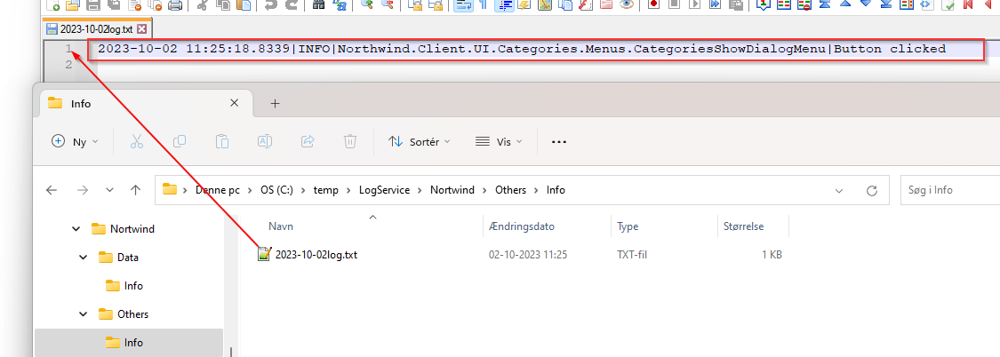

Der kan bruges forskellige slags 3. parts logging providers. [Som nævnt her](https://learn.microsoft.com/en-us/dotnet/core/extensions/logging-providers#third-party-logging-providers)

Nedenfor er vist eksempel på at bruge [NLog](https://nlog-project.org/)

**Krav**: Det ønskes at bruge NLog til at gemme logs i tekst-filer. 

**Opgave**: Tilføj "NLog.Extensions.Logging" nuget pakke, tilføj fil NLog.config og tilføj AddNLog() i App.xaml.cs

**Udførelse**: 

1. Tilføj "NLog.Extensions.Logging" nuget pakke

2. Opret ny tekst fil "NLog.config" og sæt "Copy to Output directory" -> "Copy Always"

3. Kald metoden AddNLog() i App.xaml.cs


**NLog.config**:
```xml
<?xml version="1.0" encoding="utf-8"?>
<nlog xmlns="http://www.nlog-project.org/schemas/NLog.xsd" xmlns:xsi="http://www.w3.org/2001/XMLSchema-instance"
      throwExceptions="true"  autoReload="true"
      internalLogFile="C:\temp\Log\NlogInfo.txt">
  <variable name="logDirectory" value="C:\temp\LogService" />
  <variable name="applicationname" value="Northwind" />

  <targets>
    <target name="DataLayer" xsi:type="BufferingWrapper" bufferSize="1000" flushTimeout="1000">
      <target xsi:type="File" createDirs="true" fileName="${logDirectory}\${applicationname}\Data\${level}\${shortdate}log.txt"  />
    </target>

    <target name="Errors" xsi:type="BufferingWrapper" bufferSize="1000" flushTimeout="1000">
      <target xsi:type="File" createDirs="true" fileName="${logDirectory}\${applicationname}\Errors\${level}\${shortdate}log.txt"  />
    </target>

    <target name="Others" xsi:type="BufferingWrapper" bufferSize="1000" flushTimeout="1000">
      <target xsi:type="File" createDirs="true" fileName="${logDirectory}\${applicationname}\Others\${level}\${shortdate}log.txt"  />
    </target>

  </targets>
  <rules>
    <logger name="Microsoft.EntityFrameworkCore.Database.*" levels="Info" writeTo="DataLayer" final="true"  />
	<logger name="Microsoft.EntityFrameworkCore.*" levels="Trace,Debug,Info,Warn"  final="true" />
    <logger name="*" levels="Trace,Debug,Info,Warn" writeTo="Others" final="true"  />
    <logger name="*" levels="Error,Fatal" writeTo="Errors"  />
  </rules>
</nlog>
```


**App.xaml.cs**
```c#
    protected override void ConfigurateBuilder(HostApplicationBuilder builder)
    {
        base.ConfigurateBuilder(builder);
        builder.Logging.AddNLog();
    }
```

Nu logges alt ned i tekst-filer ud fra ovenstående rules i NLog.config. Nedenfor er vist eksempel på log-fil for tidligere eksempel [knap-klik-logging](log_application.md)

