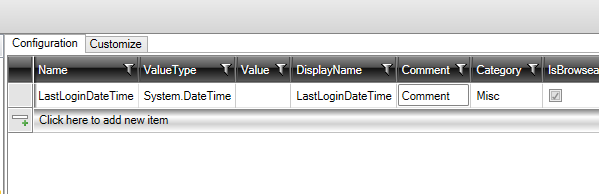

I konfigurationen af app- og user-settings defineres de properties, der skal bruges. Nedenfor er vist en konfiguration for UserSettings.



Her ønskes det at gemme dato/tid for hvornår brugeren sidst var logget på systemet.

Efter "Create code" er der kodegeneret nedenstående "UserSettings.tt.cs".
```cs
	public partial interface IUserSetting
	{
	        System.DateTime LastLoginDateTime  { get; set; }
	}

 	public partial class UserSetting: IUserSetting
	{
	    ///<summary>
        ///Comment
        ///</summary>
		[Category("Misc")]
        [Description("Comment ")]
		[DisplayName("LastLoginDateTime")]
		[Browsable(true)]
        [ReadOnly(false)]
        public System.DateTime LastLoginDateTime  { get; set; }
	}
```

Det er også muligt at tilpasse denne via en partial class. Der er en "Code Task", der hedder "UserSettings" som laver en partial class i filen "UserSettings.cs". Den kan tilpasses til f.eks. nedenstående


```cs
    public partial interface IUserSetting
    {
       
    }
    
    public partial class UserSetting
    {
        public UserSetting()
        {
                this.LastLoginDateTime= DateTime.Now;
        }
    }
```

Når applikationen lukkes gemmes UserSettings i SQL databasen og dermed gemmes hvornår brugeren sidst har været logget på.

Det er selvfølgelig også muligt at tilføje properties og metoder.

Interfacet "IUserSetting" kan injects i construtors og bruges i diverse klasser.

Ovenstående gælder også hvis AppSettings skal tilpasses. Der er interfacet "IAppSetting".