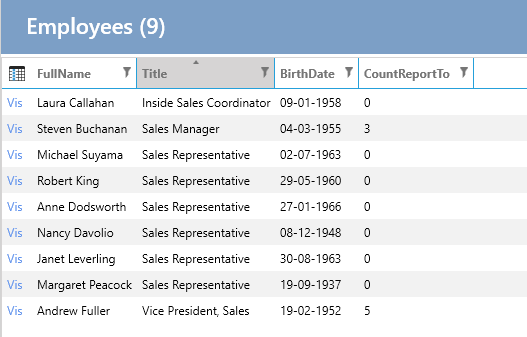

Fra tidligere eksempel [Mapper](Mapper.md) er der oprettet en custom property på data-entiteten og så er den property brugt rundt omkring i hele applikationen.

Det kan være at der kun er behov for at lave en custom-property for et view og det ikke ønskes at lave property'en på data-entiteten, men kun model-entiteten.

**Krav**: På listen over Employees skal der vises hvor mange Employees en Employees har under sig.

**Opgave**: Opret en property på EmployeesList-klassen, der laver en count på ReportTo

**Udførelse**: 

1. Opret property 'CountReportTo' på EmployeesList
2. Lav mapping
3. Tilføj property'en til selve list-kontrollen.

## Opret property

1. Vælg "User Interface".
2. Vælg "Employees".
3. Vælg fanebladet "List"
4. Under "Code Tasks" vælges "Entity - Model" og klikke på "Add Code".
5. Lav en property som nedenfor

```cs
    public partial class EmployeesList
    {
        public int CountReportTo { get; set; }

    }
```

## Lav mapping

I "Code Tasks" vælges "Mapper" og nedenstående implementeres (FullName mappingen er fra tidligere eksempel):

```cs
    public partial class EmployeesListMapperProfile
    {
        partial void AfterConfiguration(IMappingExpression<Employees, EmployeesList> mapping)
        {
            mapping.ForMember(e => e.FullName, opt => opt.MapFrom(e => $"{e.FirstName} {e.LastName}"));
            mapping.ForMember(e => e.CountReportTo, opt => opt.MapFrom(e => e.Employees2.Count));
        }
    }
```

## Tilføj property'en til listen

I "Code Tasks" vælges "List-Control" og nedenstående implementeres:

```cs
    public partial class EmployeesList
    {
        partial void AfterSetLayout()
        {
            this.AddColumn<Northwind.Data.Entity.EmployeesList>(e => e.CountReportTo, e => e.CountReportTo);
        }
    }
```

Herefter ser listen således ud:

