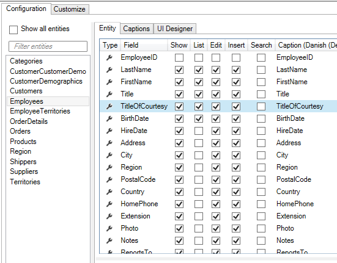
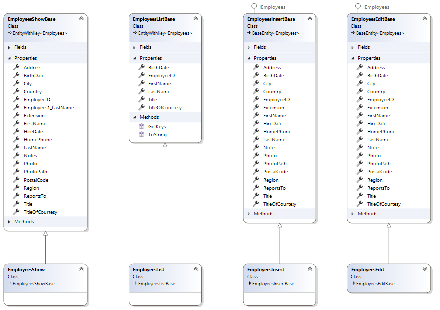

Når views og kontrollere til List- og Show-skærmbilleder kodegenereres, oprettes der også Model-klasser. I disse klasser mappes de individuelle dataentiteter ved hjælp af AutoMapper.

For eksempel, for dataentiteten "Employees", er der klasserne "EmployeesList" og "EmployeesShow", som anvendes i List- og Show-views.

Model-klasserne indeholder de properties, der er valgt i Designeren:



Den ovenstående konfiguration resulterer i følgende klasser:



Selv mappingen er kodegenereret i filen "AutoMapperUIProfiles.tt.cs", som vist nedenfor:

```csharp
    public partial class EmployeesListMapperProfile : Profile
    {
        public EmployeesListMapperProfile()
        {
            var map = CreateMap<Employees, EmployeesList>()
                .ForMember(e => e.Title, opt => opt.MapFrom(e => e.Title))
                .ForMember(e => e.BirthDate, opt => opt.MapFrom(e => e.BirthDate))
                .ForMember(e => e.FullName, opt => opt.MapFrom(e => e.FullName))
                .ForMember(e => e.EmployeeID, opt => opt.MapFrom(e => e.EmployeeID))
            .IgnoreAllPropertiesWithAnInaccessibleSetter();

            AfterConfiguration(map);

            map.ForAllOtherMembers(e => e.Ignore());

        }
        partial void AfterConfiguration(IMappingExpression<Employees, EmployeesList> mapping);
    }

```

## Tilpasning

I et andet eksempel på tilpasning [Entity](../Entity/Entity.md) skal den custom-property "FullName" mappes over til data-properties.

**Krav**: På forskellige steder i applikationen skal det fulde navn på en "Employees" vises.

**Opgave**: Opret en property i Employees-klassen, som kan bruges til at mappe "FirstName" og "LastName" sammen.

**Udførelse**: 

1. Vælg "User Interface"
2. Vælg "Employees"
3. Skift til fanebladet "List"
4. I "Code Tasks" vælg "MapperProfile" og klik "Add Code". Der vil nu blive genereret en fil ved navn "EmployeesListMapperProfile.cs".
5. Implementer den partielle metode "AfterConfiguration" og foretag mappingen, som vist nedenfor.

```csharp
        partial void AfterConfiguration(IMappingExpression<Employees, EmployeesList> mapping)
        {
            mapping.ForMember(e => e.FullName, opt => opt.MapFrom(e => $"{e.FirstName} {e.LastName}"));
        }
```

Listen vil nu fremstå som følger:

