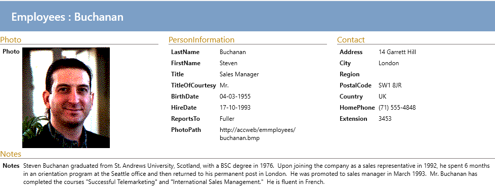

Som standard vises felterne i show-views som en lang liste.

Med Ui-designeren kan det nemt tilpasses, så felter bliver grupperet og placeret mere logisk.

Se hvordan i videoen.

<iframe width="560" height="315" src="https://www.youtube.com/embed/-IBD1lKUmGw?si=iMBbYwz_cX6kAFuh" title="YouTube video player" frameborder="0" allow="accelerometer; autoplay; clipboard-write; encrypted-media; gyroscope; picture-in-picture; web-share" allowfullscreen></iframe>

