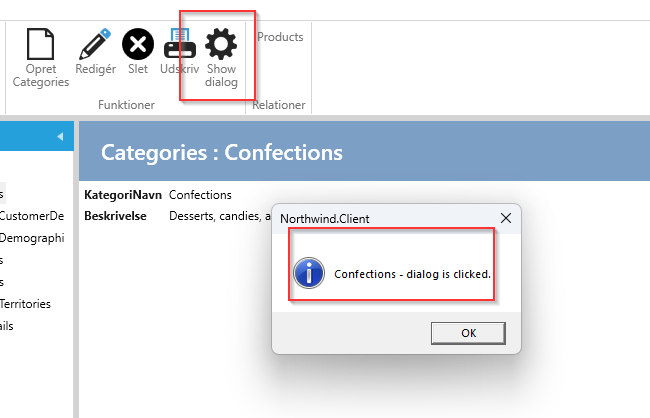

**Krav**: I show-viewet for Categories skal der være en knap i menuen, som skal vise en dialogboks, når man klikker på knappen

**Opgave**: Opret en Menu og registere den på menuservice for CategoriesShow (CategoriesShowMenuService)

**Udførelse**: 

1. Vælg "User Interface".
2. Vælg "Categories".
3. Vælg fanebladet Show.
4. Under "Code Tasks" vælges "MenuItem", indtast et Navn som menu-klassen skal have og klikke på "Add Code". 
Der vil nu blive genereret en fil ved navn CategoriesShowMenu.cs, som kan tilpasses som ønsket, som det er illustreret nedenfor.

```cs
 //TODO: Set the property "GroupName"" in the construtor and register the menu in the menuservice.
//To show the menu when the view is active, add this in the partial methode 'Initialize' in the showmenuservice: 
//this.AddMenu<Menus.CategoriesShowDialogMenu>();

public class CategoriesShowDialogMenu:MenuModelEntity<Northwind.Data.Entity.CategoriesShow>
{
    private readonly IWindowDialogService _windowDialogService;

    public CategoriesShowDialogMenu(IEventAggregator eventAggregator, IWindowDialogService windowDialogService) :base(eventAggregator)
    {
        Header = "Show dialog";
        Description = "Click to show dialog";
        GroupName = MenuGroupNames.Functions; 
        SetImages(Innova.Prism.Library.Styles.WindowsMenuImages.gear);
        Command = new LogDelegateCommand(ExecuteCategoriesShowDialogMenu, CanExecuteCategoriesShowDialogMenu);
        _windowDialogService = windowDialogService;
    }

    private bool CanExecuteCategoriesShowDialogMenu()
    {
        return this.Entity != null;
    }
     
    private void ExecuteCategoriesShowDialogMenu()
    {
        _windowDialogService.ShowInformation($"{this.Entity.CategoryName} - dialog is clicked.");
    }
}
```

I ovenstående er windowsDialogService injected og bliver brugt ved executeCommand'en.

Show-view ser nu således ud

