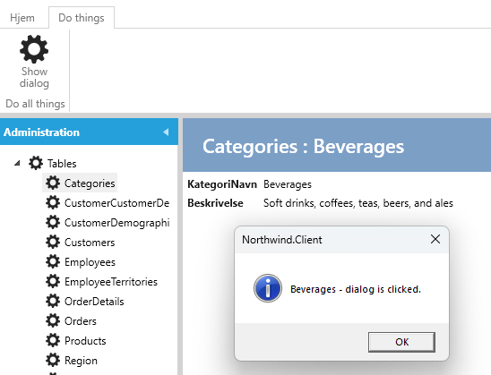

Til hvert view er der en menu-service, som bestemmer hvordan toolbaren skal se ud i viewet.

Der kan tilføjes faneblade, grupper og knapper via servicen.

**Krav**: I show-viewet for Categories skal der være et faneblad "Do things", som indeholder en gruppe "Do all things" med en knap som viser en dialog.

**Opgave**: I CategoriesShowMenuService tilføjes et faneblad, en gruppe og en menuknap.

**Udførelse**: 

1. Vælg "User Interface".
2. Vælg "Categories".
3. Vælg fanebladet Show.
4. Under "Code Tasks" vælges "MenuService" og klikke på "Add Code". 

Der vil nu blive genereret en fil ved navn CategoriesShowMenuService.cs, som kan tilpasses som ønsket, som det er illustreret nedenfor.

```cs
    public partial class CategoriesShowMenuService
    {
        const string CategoryTabName = "CategoryTabName";
        const string CategoryGroupName = "CategoryGroupName";
        partial void Initialize()
        {
            this.AddTab(CategoryTabName, "Do things", 4);
            this.AddGroup(CategoryGroupName, "Do all things", CategoryTabName, 2);
            this.AddMenu<Menus.CategoriesShowDialogMenu>(CategoryGroupName, 1);
        }
    }
```

Show-viewet ser således ud:

