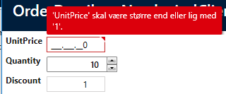
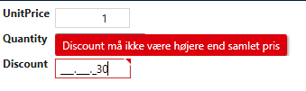

# Andre Eksempeler


```csharp
namespace NorthwindClient.Entity
{
    public partial class OrderDetailsValidator
    {
        const string updateRuleset = "UpdateRuleset";

        partial void AfterAddRules()
        {
            this.UpdateRulesets.Add(updateRuleset);

            RuleSet(updateRuleset, () =>
            {
                //Opret simpel validering for et enkelt felt
                RuleFor(ent => ent.UnitPrice).GreaterThanOrEqualTo((decimal)1).WithName(GetCaption(e => e.UnitPrice));
                //Opret kompleks validering for et felt
                RuleFor(ent => ent.Discount).Must(ValidateDiscount).WithMessage("Discount må ikke være højere end samlet pris").WithName(GetCaption(e => e.Discount));


            });
        }

        private bool ValidateDiscount(OrderDetails obj, float arg)
        {
            //The discount must not ex
            return (obj.Discount > 0) && (obj.UnitPrice * obj.Quantity) > (decimal)obj.Discount;
        }
    }
}
```

Hvilket vil resultere i valideringen vil blive vist i UI som følgende eksempel:

Simpel validering på UnitPrice

 

Kompleks validering på Discount

 