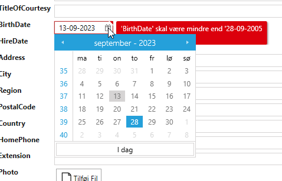

# Basic Validation

**Krav**: Ansatte skal være over 18 år

**Opgave**: Lave en validation rule på property'en "BirthDay". "BirthDay" skal være over tilbage 18 år fra dags dato.

**Udførelse**: 

1. Vælg "Validation"
2. Vælg "Employees"
3. I "Code Tasks" vælg "Validator" og klik "Add Code".  Der bliver nu genereret en EmployeesValidator.cs fil, som frit kan tilpasses, som vist nedenfor.

I dette tilfælde er partial metoden "AfterInitialize" implementeret.

```cs
 public partial class EmployeesValidator
 {
     partial void AfterInitialize()
     {
         RuleSet(RuleSetNames.PropertyRuleSetName, () =>
         {
             RuleFor(ent => ent.BirthDate).LessThan(DateTime.Now.AddYears(-18));
         });
     }
 }
```

Det betyder i UI ser det således ud, hvis man indtaster en "forkert" dato.

