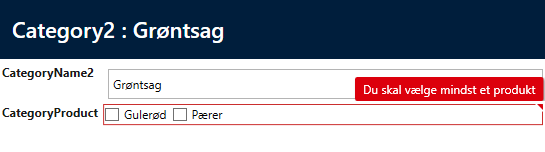
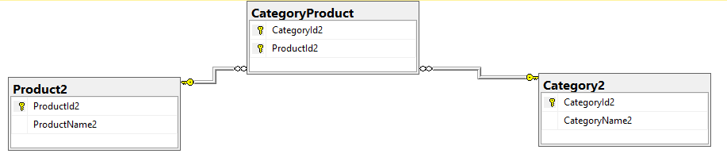

# Viewmodel validation

I nogle sammenhæng er det relevant at kunne lave validation på selve viewmodellen og ikke kun entiteten.
For eksempel på en checkbox-liste med relateret data.



Med følgende tabeller/relationer:


Den relateret liste er en liste på viewmodellen og ikke på selve entiteten og for at få en validation på den liste skal der laves en validation på viewmodellen.

Det laves ved 2 steps:

1. Kode selve validationen
2. Indfør validation i edit- og insert-viewmodellen.

## 1. Kode validation

Selve validation laves som en normal validation ud fra basevalidator.: 
Eksemplet er at en entitet "category2" skal have mindst et "product2".

```csharp
public interface ICategory2ViewModel
{
  InlineRelatedManyToManyListViewModel<NorthwindClient.Entity.CategoryProduct, NorthwindClient.Entity.Product2> InlineCategoryProduct { get; set; }
}

public class Category2ViewModelValidator : BaseValidator<ICategory2ViewModel>
{
        protected override void DefaultAddPropertyRulesMethod()
        {
            base.DefaultAddPropertyRulesMethod();
            RuleSet(PropertyRulesetName, () =>
            {
                RuleFor(ent => ent.InlineCategoryProduct).Must((vm, inline) => ValidateCategoryProduct(vm)).WithMessage("Du skal vælge mindst et produkt");
            });
        }
private bool ValidateCategoryProduct(ICategory2ViewModel obj)
{
            if (obj.InlineCategoryProduct.SelectedItems!=null)
            {
                return obj.InlineCategoryProduct.SelectedItems.OfType<Entity.Product2>().Count() > 0;
            }
            return true;
        }
}
```

Der er lavet et interface (ICategory2ViewModel) i stedet for at bruge hele viewmodellen, fordi så kan man bruge samme validator til både edit og insert. Interfacet indeholder så den ene property fra edit/insert-viewmodellen, som er kodegeneret via Designeren.

## 2. Indfør validation i edit- og insert-viewmodellen

```csharp
    public partial class Category2InsertViewModel: ICategory2ViewModel
    {

        protected override IEntityValidator GetViewModelValidator()
        {
            return new Category2ViewModelValidator();
        }
    }
```

Det kræver at man implementere interfacet på viewmodellen og overrider GetViewModelValidator.
