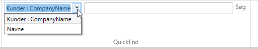

# Opret quickfind

QuickFinds laves i shell'ens viewmodel. 

Nedenstående er der vist, hvordan man kan lave QuickFinds på to forskellige måder i constructoren på MainViewModel.cs.

## Eksempel 1 - QuickFind på et felt
Det første eksempel viser, hvordan man laver en QuickFind på feltet `CompanyName` på entiteten `Customers`. 

```csharp
//Quickfind på et felt
this.QuickFindViewModel.SearchItems.Add(new QuickFindItem<Entity.Customers>(e => e.CompanyName));
```

## Eksempel 2 - QuickFind på flere felter
Det andet eksempel viser, hvordan man laver en QuickFind, som søger på flere felter på entiteten `Employees` inkl. feltet `LastName` på den relaterede entitet `Manager`

```csharp
//Quickfind på flere felter
this.QuickFindViewModel.SearchItems.Add(new QuickFindItem<Entity.Employees>()
 .WithSearchField(e => e.LastName)
 .WithSearchField(e => e.FirstName)
 .WithSearchField(e => e.Manager.LastName)
 .WithTitle("Navne"));
```

## Eksempel 3 - Sætte en bestemt search-operator for feltet

De enkelte data-typer har en default-searchOperator. F.eks. så har string 'like' som default, int har 'equals' osv.
Datoer har som default 'between'. I en quickfind er der kun en parameter og derfor ikke muligt at bruge default-searchOperatoren 'between', da den kræver to parametre. Det kan ændres i Quickfind ved at angive en generic. I nedenstående er sat 'EqualsOperator' på OrderDate.
```csharp
this.QuickFindViewModel.SearchItems.Add(new QuickFindItem<Entity.Orders>()
   .WithSearchField<EqualsOperator>(e => e.OrderDate)
   .WithTitle("OrderDate"));
```

## Eksempel 4 - Sætte base filter for en søgning

Såfremt man ønsker at tilknytte et ekstra filter til en given QuickFindItem, kan dette gøres på følgende måde.
Bemærk! benyttes WithBaseFilter flere gange, så overskrives BaseFilter blot så sidstsatte filter bliver det aktuelle.
```csharp
//Quickfind på et enkelt felt med base filter
this.QuickFindViewModel.SearchItems.Add(new QuickFindItem<Entity.Customers>(e => e.CompanyName)
    .WithBaseFilter(p => p.CustomerID.StartsWith("A")));
```

Som standard bliver der som titel på den enkelte QuickFind vist en tekst i følgende format `<EntityCaption> : <PropertyCaption>`.
Dette kan ændres ved at bruge metoden `WithTitle`, som det er vist i eksempel 2.


