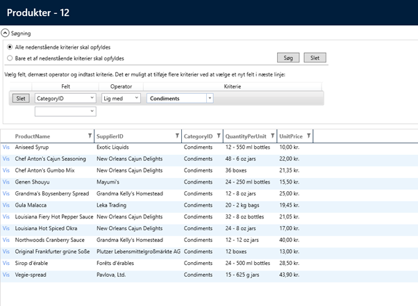

# Avanceret Search

Det er muligt at få vist en mere avanceret søgning ved at indføre følgende kode i searchviewmodel'en:


```csharp
public partial class ProductsSearchViewModel
{
   partial void AfterLoadData()
   {
      this.SearchViewMode =SearchViewModeEnum.Advanced;
   }
}
```

Den avanceret søgning ser således ud:

 


## Søgning i relaterede tabeller
Hvis man vil lave fritekstsøgning i relaterede tabeller kan det også gøres i `AfterLoadData`:

```csharp
partial void AfterLoadData()
{
    var categoryTextField = new EntitySearchFieldViewModel(LocalizationHandling.GetCaption<Entity.Categories>(e => e.CategoryName), "Categories.CategoryName", typeof(string));
    this.Fields.Add(categoryTextField);
}
```
Constructor'en på `EntitySearchFieldViewModel` tager følgende : <FieldCaption>, <BindingPath>, <PropertyType>
