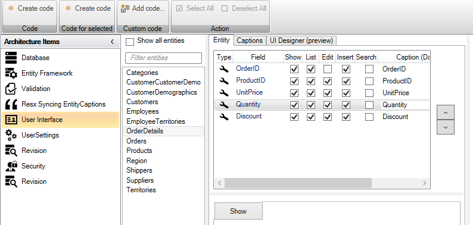

# "Custom control" på et felt

Under UI IAD'en fremfindes det felt man ønsker tilknytte en custom control til.

 

I propertiesvinduet i Visual Studio, for det valgte felt, vælges den kontrollen "Custom control" for henholdsvis UpdateControl eller ShowControl. Alt efter om man ønsker kontroltypen i redigering eller blot i visning.

 

Klik "Create code" under ribbongruppen "Code for selected"

Under Controls for OrderDetails, vil der nu være oprettet en EditQuantityControl.xaml.

 

```xml
<UserControl x:Class="NorthwindClient.UI.OrderDetails.Controls.EditQuantityControl"
             xmlns="http://schemas.microsoft.com/winfx/2006/xaml/presentation"
             xmlns:x="http://schemas.microsoft.com/winfx/2006/xaml"
             xmlns:mc="http://schemas.openxmlformats.org/markup-compatibility/2006" 
             xmlns:d="http://schemas.microsoft.com/expression/blend/2008" 
             mc:Ignorable="d" 
             d:DesignHeight="300" d:DesignWidth="300"
             x:Name="EditQuantityControlName">

			<TextBlock Text="{Binding Quantity}"/>
</UserControl>
```

Kontrollens datacontext vil være entiteten, og man vil kunne tilpasse kontrollen til at indeholde den editor man ønsker. 

Eks:

```xml
<UserControl x:Class="NorthwindClient.UI.OrderDetails.Controls.EditQuantityControl"
             xmlns="http://schemas.microsoft.com/winfx/2006/xaml/presentation"
             xmlns:x="http://schemas.microsoft.com/winfx/2006/xaml"
             xmlns:mc="http://schemas.openxmlformats.org/markup-compatibility/2006" 
             xmlns:d="http://schemas.microsoft.com/expression/blend/2008"
             xmlns:telerik="http://schemas.telerik.com/2008/xaml/presentation"
             mc:Ignorable="d" 
             d:DesignHeight="300" d:DesignWidth="300"
             x:Name="EditQuantityControlName">
    <telerik:RadNumericUpDown Value="{Binding Quantity, Mode=TwoWay}"
                              Minimum="1"
                              HorizontalAlignment="Stretch"
                              VerticalAlignment="Center"
                              MinWidth="113"
                              NumberDecimalDigits="0" />
</UserControl>
```
