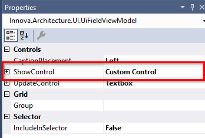

# Custom control relation

Det er muligt at lave en custom control på en felt, hvori der er relateret data.
Eksempel på Category, hvor man gerne vil have vist listen for produkter med lidt ekstra formatering, logik m.m.

Som vist nedenfor
 

Her er vist kategoriens produkter i en liste med produktnavn og pris.

Det gøres ved 
1. at hakke products af, som vist nedenfor.

 

2. Sætte ShowControl til "Custom Control", som vist nedenfor.

 

3. Kodegenere.

Der er nu kodegeneret en ny fil under "Categories\Controls\ShowProductsControl.xaml".
Som standard indeholder den bare en textblock hvor bindingen er sat til Products-property'en på Category-entiteten.
Det skal ændres da vi vil binde på en collection, der ligger på viewmodellen.

```xml
<UserControl x:Class="NorthwindClient.UI.Categories.Controls.ShowProductsControl"
             xmlns="http://schemas.microsoft.com/winfx/2006/xaml/presentation"
             xmlns:x="http://schemas.microsoft.com/winfx/2006/xaml"
             xmlns:mc="http://schemas.openxmlformats.org/markup-compatibility/2006" 
             xmlns:d="http://schemas.microsoft.com/expression/blend/2008" 
             mc:Ignorable="d" 
             d:DesignHeight="300" d:DesignWidth="300"
             xmlns:localControls="clr-namespace:NorthwindClient.UI.Categories.Controls"
             x:Name="ShowProductsControlName">
    <ItemsControl ItemsSource = "{Binding RelativeSource={RelativeSource FindAncestor,   AncestorType={x:Type localControls:CategoriesDetail}},Path=DataContext.ProductsItems.Items}">
        <ItemsControl.ItemTemplate>
            <DataTemplate>
                <StackPanel Orientation="Horizontal">
                    <TextBlock Text="{Binding ProductName}"/>
                    <TextBlock Text="{Binding UnitPrice, StringFormat={}   \({0:C}\)}"/>
                </StackPanel>
            </DataTemplate>
        </ItemsControl.ItemTemplate>
    </ItemsControl>
</UserControl>
```
