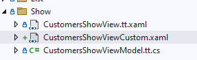

# View - Custom Show

I nogle tilfælde vil man designe sin egen show-view helt fra bunden (xaml-mæssigt). 

Eksemplet tager udgangspunkt i "Customers", hvor der laves et custom show-view.

Ved at marker "Customers", marker fanebladet "Show", vælge "View - Custom " under "Code Tasks" og klik "Add Code".



For at det nye custom-show-view bruges i applikationen skal det registreres i CustomersModule.

Hvordan det gøres står  som kommentar i koden i custom-show-view'et:

```csharp
        //Implementation information:
        //Register the view in the CustomersModule in the partial methode: AfterRegisterTypes
        //
        //containerRegistry.RegisterForNavigation<Views.Show.CustomersShowViewCustom, Views.Show.CustomersShowViewModel>(nameof(Views.Show.CustomersShowView));

```

Samme fremgangsmåde kan gøres List, Edit og Insert.