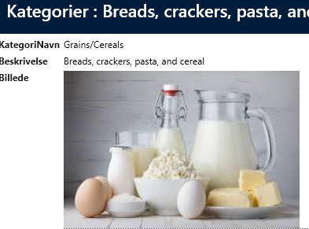
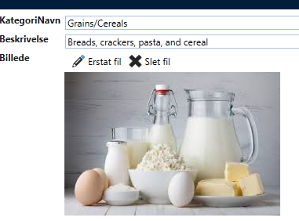
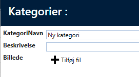

# 1 felt (bytes)

Hvis der kun er et felt (som i Category) varbinary(max) og der ikke er konfigureret noget på kontrollerne, så vil "Image - show" vise billeder og ikke vise noget ved andre fil-typer.

Her er det en billede-fil
 

Her er det en excel-fil, hvor der ikke vises noget
 

For "Image - Editor" er det muligt at uploade ved Insert eller erstatte/slette ved Update.

Ved Update:
 

Ved Insert:
 

Ved klik på "Erstat fil" eller "Tilføj fil" kommer der en filedialog frem hvorfra man kan vælge en fil.