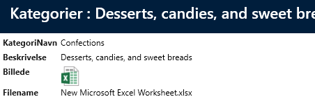
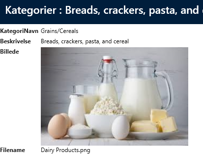

# 2 felter (bytes-og-filename)

Hvis man vil understøtte at man kan redigere filer og uploade dem igen, skal der tilføjes et felt i tabellen Category. Feltet skal indeholde filnavnet. I dette tilfælde har vi udvidet Category tabellen med et felt "Filename".
Herefter skal man konfigurere de to "Image" kontroller med hvilket felt der indeholder "FileName".

I "User Interface" vælges "Picture"-feltet og i propertygriden kan man nu konfigurere property'en "FileNameField" på begge kontroller, som vist nedenfor.
 

Desuden tilføjer vi feltet "Filename" til show og list.

 

På Show vil ikonet for andre filtyper end billed-filtyper vises.
Eksempel for excel
 

For billeder:

 

## Rediger filer

Når man redigere så er der flere muligheder nu.

 

Åben fil - åbner filen (i dette tilfælde i excel)
Åben file med - windows "Åben med" åbnes og man kan nu vælge hvilket program filen skal åbnes med.
Erstat fil - uploade en anden fil
Slet fil - sletter filen

Hvis man klikker på "Åben fil" åbnes filen i excel og man kan begynde at redigere filen.
Når man er færdig med at redigere filen, gemmes filen og luk excel, så man kommer tilbage til redigering.
Nu ser toolbaren således ud:
 

Hvis man klikker på "Upload fil" så uploades den fil man lige har redigeret.

Herefter klikker man på "Gem" for hele vinduet og filen bliver gemt i selve databasen.
Bemærk at feltet "Filename" bliver automatisk opdateret når man uploader en fil.

