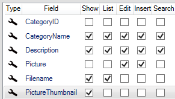
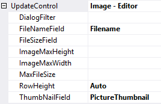
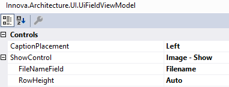

# 3 felter (bytes,-filename-og-thumbnail)

I nogle tilfælde vil man gerne gemme et thumbnail af et billede og vise det på show-siden i stedet for original-billedet. Det typisk hvor der bliver uploadet store billeder og man af performance-hensyn ikke ønsker at hive f.eks. et 10mb billede ud af databasen hver gang man går ind på en show-side.

Her tilføjer vi et felt til tabellen Category "PictureThumbnail" varbinary(max).

Konfiguration vil se således ud.

 

Feltet "Picture" er fjernet fra show og "PictureThumbnail" er tilføjet til show.

Konfigurationen af UpdateControl på "Picture" vil se således ud:

 

Der er konfigurereret hvilket felt, der indeholder thumbnail. Det er i selve upload af en fil at "PictureThumbnail" feltet bliver opdateret med et Thumbnail.

Hvis man vil understøtte at vise ikoner i "PictureThumnail" feltet skal man konfigurere kontrollens "FilenameField" property:
 
