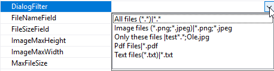

# Andre-konfigurationer

Der er andre konfigurationsmuligheder for file upload:

 

**Diaglogfilter** - her kan man vælge et foruddefineret filter eller skrive et selv. Det filter bliver sat på OpenFileDialog og dermed kan man begrænse hvilke filtyper, der kan uploads.
 

**FileSizeField** - Hvis man vil gemme filestørrelsen i databasen kan man oprette et felt i databasen og vælge feltet her. Feltet vil blive automatisk opdateret ved upload af en fil.

**ImageMaxHeight** - den maksimale højde for billedet, når det vises i viewet.

**ImageMaxWidth** - den maksimale bredde for billedet, når det vises i viewet.

**MaxFileSize** - Her kan man lægge en begrænsning på hvor store filerne må være. Værdien er i MB.
