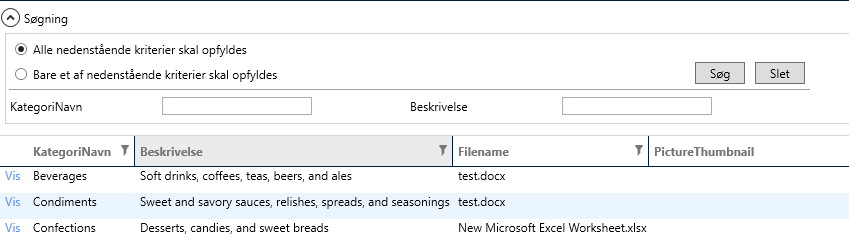
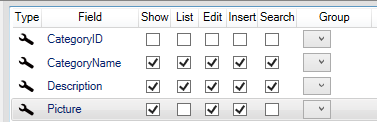

# Search

Viser "search" i list-templaten for Category, som vist nedenfor.

 

Vælg CategoryName og Description og klik "Create Code"

 

Start applikationen. Som default er listen tom og man skal klikke på "Søg" for at få vist listen.

## ExecuteSearchOnStartup 

Hvis man vil have vist listens indhold, når man kommer ind på listen skal man kode i en partial class til search-viewmodel'en.

```csharp
public partial class CategoriesSearchViewModel
 {
     partial void Initialize()
     {
         this.ExecuteSearchOnStartup = true;
     }
 }
```

## AutoCollapseOnSearch

Hvis man ønsker at søgepanelet automatisk skal kollapses når man foretager en søgning, kan dette gøres ved at indsætte følgende kode i partial klassen til SearchViewModel'en.

```csharp
public partial class OrdersSearchViewModel
{
   partial void Initialize()
   {
      this.AutoCollapseOnSearch = true;
   }
}
```
