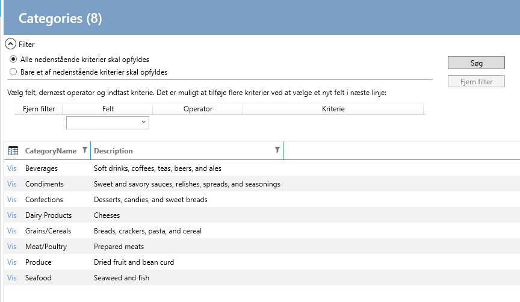

# Search

Der kan laves to søge-skærmbilleder: Simple og Avanced.

**Simple**

**Avanced**

Og de to skærmbilleder kan vises på to forskellige måder: I værktøjslinen eller oven over listen:

**Værktøjslinen**

**Oven over listen**

I designeren vælges "User interface" og entiteten der skal laves søge-skærmbillede for.

Der vælges hvilke felter der skal være søgebare, som vist nedenfor.

Dernæst vælges fanebladet "Search" og i visual studio property-vinduet vælges konfigurationen for søge-skærmbilledet.

Herefter klikkes på "Create code".

